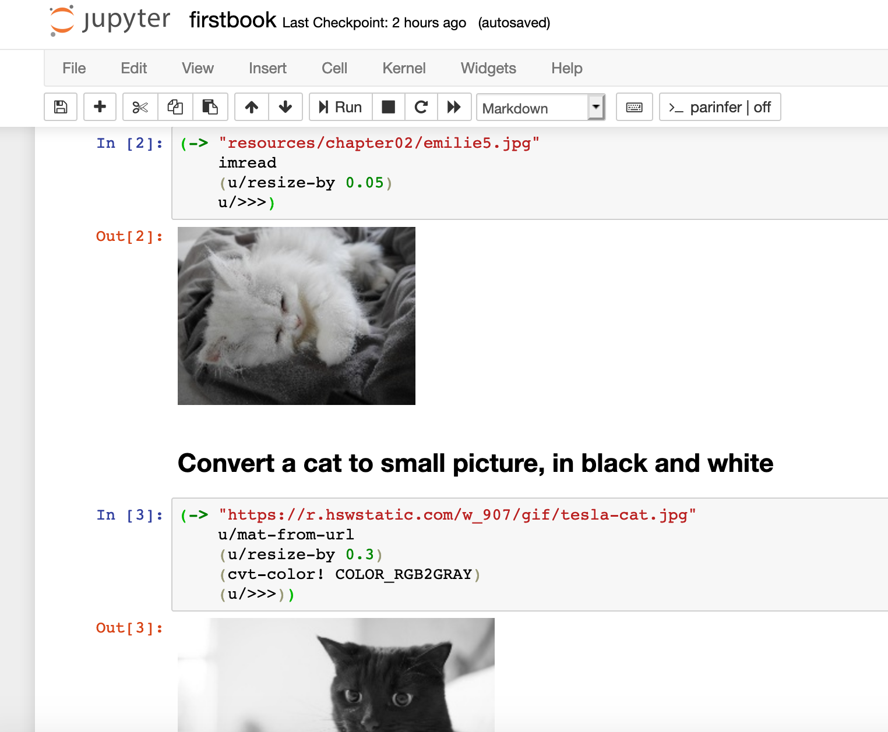
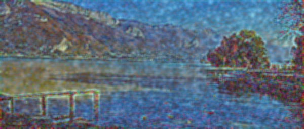

[Travis](https://travis-ci.org/hellonico/origami): 

# TOC

   * [Lena in Clojure](#lena-in-clojure)
   * [Support for OpenCV 4.1.2 is in!](#support-for-opencv-412-is-in)
   * [Book on using Origami](#book-on-using-origami)
   * [2 minutes intro if you have clj installed](#2-minutes-intro-if-you-have-clj-installed)
   * [Getting Started](#getting-started)
      * [Required Software to install](#required-software-to-install)
      * [generate a project](#generate-a-project)
      * [Running the samples](#running-the-samples)
      * [Jupyter Notebook](#jupyter-notebook)
      * [Gorilla Based Notebook](#gorilla-based-notebook)
      * [samples git project](#samples-git-project)
   * [Docker official image](#docker-official-image)
   * [more samples](#more-samples)
   * [opencv compatibility notes](#opencv-compatibility-notes)
   * [electron based IDE](#electron-based-ide)
   * [With Tensorflow and Caffee Neural Network](#with-tensorflow-and-caffee-neural-network)
   * [With MxNET](#with-mxnet)
   * [Troubleshooting](#troubleshooting)
       * [linux: video stream doesn't start](#linux-video-stream-doesnt-start)
       * [Ubuntu 14](#ubuntu-14)

## Setup

Add the following the to your `project.clj`:

[

# Lena in Clojure

```
(ns opencv4.lena
	(:require [opencv4.core :refer :all]))

(defn -main[& args]
	(-> "resources/lena.png"
		(imread)
		(gaussian-blur! (new-size 17 17) 9 9)
	  (imwrite "resources/blurred.png")))
```

Which turns:

</img>

into


 

# Support for OpenCV 4.1.2 is in!

Origami is an opencv generated wrapper for Clojure which allows some of the opencv code to be written in a concise way, by putting emphasis on processing pipelines.


> After staring at origami directions long enough, you sort of become one with them and start understanding them from the inside.
> Zooey Deschanel

```
(require
  '[opencv4.utils :as u]
  '[opencv4.core :refer :all])

(->
 (imread "doc/cat_in_bowl.jpeg")
 (cvt-color! COLOR_RGB2GRAY)
 (canny! 300.0 100.0 3 true)
 (bitwise-not!)
 (u/resize-by 0.5)
 (imwrite "doc/canny-cat.jpg"))
```


# Book on using Origami

[Java Image Processing Recipes: With OpenCV and JVM](http://a.co/3iImWz7) published by Apress will show you all the tricks to play and produce art and understand the underlying concepts of origami.


# 2 minutes intro if you have clj installed


If you already have the clojure CLI, clj, installed then you can be ready in 2 minutes.

In a new folder, create the deps.edn file:
```
{:mvn/repos
   {"vendredi" {:url "https://repository.hellonico.info/repository/hellonico/"}}
 :deps 
   { origami {:mvn/version "4.0.0-3"}}
```

Start a repl:

```
clj 
```

and require the two most used origami namespaces:

```
   (require
    '[opencv4.utils :as u]
    '[opencv4.core :refer :all])
```

Finally, here is a short snippet to download an image from a url, resize it and store it to the local file system.

```
(-> "https://raw.githubusercontent.com/hellonico/origami/master/doc/cat_in_bowl.jpeg"
    (u/mat-from-url)
    (u/resize-by 0.3)
    (imwrite "cat.jpg"))
```

You'll get a cat in your own bowl:


You also would know you can also directly load, turn to gray, and change the size with:

```
(-> "https://raw.githubusercontent.com/hellonico/origami/master/doc/cat_in_bowl.jpeg"
    (u/mat-from-url IMREAD_REDUCED_GRAYSCALE_4)
    (imwrite "cat.jpg"))
```


# Getting Started 

## Required Software to install

- install jdk 1.8
- install [leiningen](https://leiningen.org/#install) (it is a simple script ...)
- that's all … 

## generate a project

Create a brand new origami based project using the [clj-opencv](https://github.com/hellonico/clj-opencv) Leiningen project template

```
# install the sample
lein new clj-opencv hello-origami

# change directory
cd hello-origami

# run the template simple example
lein run

# or using clj 
clj -m opencv4.ok
# 
clj -m opencv4.lena
```

## Running the samples

Some examples are included in the project template.

Origami Setup Check (including OpenCV native dependencies check)
```
lein run -m opencv4.ok
```

Some Simple OpenCV transformation using origami
```
lein run -m opencv4.simple
```

A more advanced set of imaging transformation.
```
lein run -m opencv4.tutorial
```

Webcam Sample
```
lein run -m opencv4.videosample
```

## Jupyter Notebook

The lein-jupyter plugin is added to the project.clj, so i fyou have followed the installation steps for lein-jupyter, you should have an integrated working jupyter notebook.
```
lein jupyter notebook
```




## Gorilla Based Notebook

The gorilla plugin is included in the project template. 

```
lein notebook

# or without samples and just the docker image
docker run -it -p10000:10000 hellonico/origami lein notebook
```
Two notebooks are included in the project template:

- [http://0.0.0.0:10000/worksheet.html?filename=notes/practice.clj](http://0.0.0.0:10000/worksheet.html?filename=notes/practice.clj)
- [http://0.0.0.0:10000/worksheet.html?filename=notes/empty.clj](http://0.0.0.0:10000/worksheet.html?filename=notes/empty.clj)


## samples git project 

A copy of the samples can also be cloned from a generated project.

```
git clone https://github.com/hellonico/origami_samples.git
```

# Docker official image

```
# default run with lein
docker run -it hellonico/origami lein run

# official image and custom src folder using clj
docker run -it -v <path_to_local_src>:/usr/src/app/src  hellonico/origami clojure -m <your_custom_namespace>

# start the gorilla notebook
docker run -it -p10000:10000 hellonico/origami lein notebook

```

# more samples

For many, many more examples, you can also clone and check the [https://github.com/hellonico/opencv-fun](opencv-fun) repository:

```
git clone https://github.com/hellonico/opencv-fun.git
```

# opencv compatibility notes

| Distribution | Version    | Status | Comments                                                    |
| ------------ | ---------- | :----: | ----------------------------------------------------------- |
| OSX          | Mojave     |   o    |                                                             |
| Windows      | 10         |   o    |                                                             |
| Ubuntu 18    | glibc 2.23 |   o    | Compiled with 2.23 no ffmpeg                                |
| Manjaro      | glibc 2.23 |   o    | Compiled with 2.23 no ffmpeg                                |
| Debian       | glibc 2.23 |   o    | Compiled with 2.23 no ffmpeg                                |
| Old Debian   | glibc 2.19 |   △    | Compiled with 2.19<br />Needs a different opencv native jar |

Bonus link to see what is compatible. https://abi-laboratory.pro/?view=timeline&l=glibc

To try the slightly old setup for linux, you can use this repository:

https://github.com/hellonico/origami_samples_libc2_19

# electron based IDE

An experimental self-contained native application for windows and osx can be downloaded from the following project:

https://github.com/hellonico/origami-electron/releases


# With Tensorflow and Caffee Neural Network

There is now a [sibling project](https://github.com/hellonico/origami-dnn) showing how to use a caffee based network to identify object with origami and [mxnet](http://mxnet.incubator.apache.org/).

 

# With MxNET

There is a sample origami-mxnet project at https://github.com/hellonico/origami-mxnet, showing an integration of the two on a neural style network "image tranfer".




# Troubleshooting

### linux: video stream doesn't start

To get the stream from the webcam running, you would need the extra libv4l library on your system.

```
apt-get install libv4l-dev
```

or

```
pacman -S libv4l
```

### OSX

You may be missing some extra libries. Those won't be required in the future by default, but for now, please use:

```
brew install tbb webp libtiff 
```

### Ubuntu 14

... has a very outdated libstdc++, and the libopencv_java won't load. To install a newer libstdc++, you can try the following: (taken from: Stck

```
sudo add-apt-repository ppa:ubuntu-toolchain-r/test
sudo apt update
sudo apt-get install libstdc++6 
```

Copyright @Nicolas Modrzyk - 2017-2019
Eclipse Public License 

### Let's Encrypt Certificates

We are using [let's encrypt](https://letsencrypt.org/) for certificates to host the depending binaries. Old JDK versions (for example 1.8.80) are missing the root letsencrypt certificate and so the java runtime cannot validate our certificate.
To solve this, update to a recent version of the Java Development Kit.

```
Resolving javax.net.ssl.SSLHandshakeException: sun.security.validator.ValidatorException: PKIX path building failed Error?
```

[Resolving javax.net.ssl.SSLHandshakeException](https://stackoverflow.com/questions/9619030/resolving-javax-net-ssl-sslhandshakeexception-sun-security-validator-validatore/47952835#47952835)
