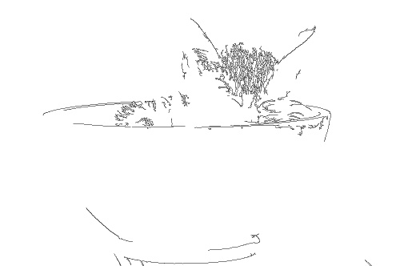
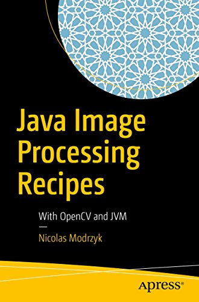
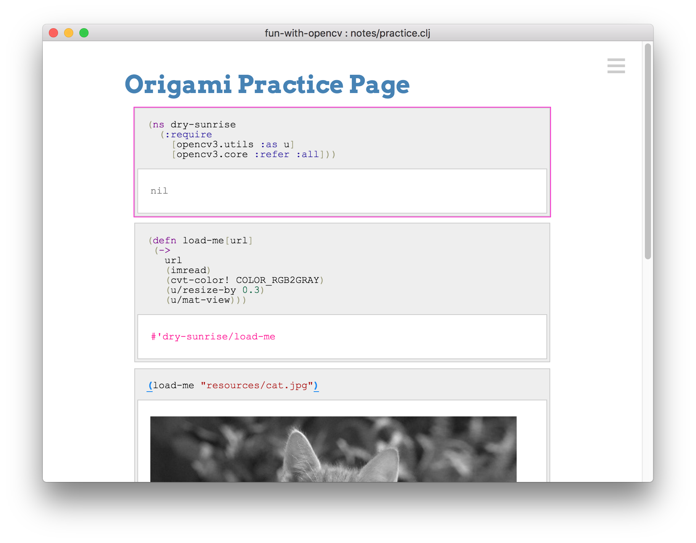
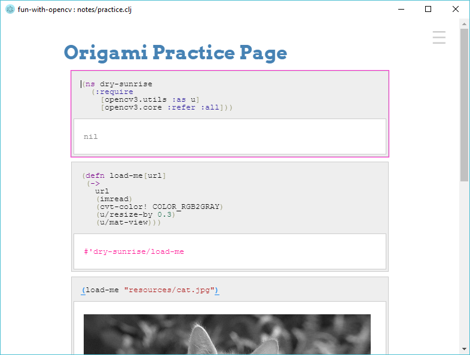
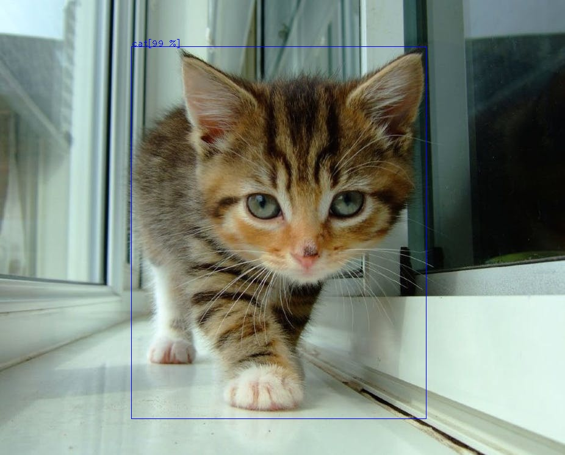

# Lena in Clojure

```
(ns opencv4.lena
	(:require [opencv4.core :refer :all]))

(defn -main[& args]
	(-> "resources/lena.png"
		(imread)
		(gaussian-blur! (new-size 17 17) 9 9)
	  (imwrite "resources/blurred.png")))
```

Which turns:

</img>

into


 

# Support for OpenCV 4.0.0 is in!

Origami is an opencv generated wrapper for Clojure which allows some of the opencv code to be written in a concise way, by putting emphasis on processing pipelines.


> After staring at origami directions long enough, you sort of become one with them and start understanding them from the inside.
> Zooey Deschanel

```
(require
  '[opencv4.utils :as u]
  '[opencv4.core :refer :all])

(->
 (imread "doc/cat_in_bowl.jpeg")
 (cvt-color! COLOR_RGB2GRAY)
 (canny! 300.0 100.0 3 true)
 (bitwise-not!)
 (u/resize-by 0.5)
 (imwrite "doc/canny-cat.jpg"))
```




# Book on using Origami

[Java Image Processing Recipes: With OpenCV and JVM](http://a.co/3iImWz7) published by Apress will show you all the tricks to play and produce art and understand the underlying concepts of origami.




# 2 minutes intro if you have clj installed


If you already have the clojure CLI, clj, installed then you can be ready in 2 minutes.

In a new folder, create the deps.edn file:
```
{:mvn/repos
   {"vendredi" {:url "https://repository.hellonico.info/repository/hellonico/"}}
 :deps 
   { origami {:mvn/version "4.0.0-0"}}
```

Start a repl, and require the two most used origami namespaces:

```
   (require
    '[opencv4.utils :as u]
    '[opencv4.core :refer :all])
```

And then use it to download an image from a url, resize it and download it to the local file system.

```
(-> "https://raw.githubusercontent.com/hellonico/origami/master/doc/cat_in_bowl.jpeg"
    (u/mat-from-url)
    (u/resize-by 0.3)
    (imwrite "cat.jpg"))
```

You'll get a cat in your own bowl:


You also would know you can also directly load, turn to gray, and change the size with:

```
(-> "https://raw.githubusercontent.com/hellonico/origami/master/doc/cat_in_bowl.jpeg"
    (u/mat-from-url IMREAD_REDUCED_GRAYSCALE_4)
    (imwrite "cat.jpg"))
```


# Getting Started 

## Required Software to install

- install jdk 1.8
- install [leiningen](https://leiningen.org/#install) (it is a simple script ...)
- that's it ! (as in, no need to install anyother OpenCV thing ...)

## generate a project

Create a brand new origami based project using a Leiningen project template

```
# install the sample
lein new clj-opencv hello-origami

# change directory

cd hello-origami

# run the template simple example
lein run
# or ..
clj -m opencv4.ok
```

## Running the samples

Some examples are included in the project template.

Origami Setup Check (including OpenCV native dependencies check)
```
lein run -m opencv4.ok
```

Some Simple OpenCV transformation using origami
```
lein run -m opencv4.simple
```

A more advanced set of imaging transformation.
```
lein run -m opencv4.tutorial
```

Webcam Sample
```
lein run -m opencv4.videosample
```

Gorilla Based Notebook

```
lein notebook
```

And two notebooks are included in the project template:

- [http://0.0.0.0:10000/worksheet.html?filename=notes/practice.clj](http://0.0.0.0:10000/worksheet.html?filename=notes/practice.clj)
- [http://0.0.0.0:10000/worksheet.html?filename=notes/empty.clj](http://0.0.0.0:10000/worksheet.html?filename=notes/empty.clj)

## samples git project 

If you do not have Lein installed, you can also clone a checkout of the generated project.

```
git clone https://github.com/hellonico/origami_samples.git
```

# many more samples

For many, many more examples, you can also clone and check the [https://github.com/hellonico/opencv-fun](opencv-fun) repository:

```
git clone https://github.com/hellonico/opencv-fun.git
```

# opencv compatibility notes

| Distribution | Version    | Status | Comments                                                    |
| ------------ | ---------- | :----: | ----------------------------------------------------------- |
| OSX          | Mojave     |   o    |                                                             |
| Windows      | 10         |   o    |                                                             |
| Ubuntu 18    | glibc 2.23 |   o    | Compiled with 2.23 no ffmpeg                                |
| Manjaro      | glibc 2.23 |   o    | Compiled with 2.23 no ffmpeg                                |
| Debian       | glibc 2.23 |   o    | Compiled with 2.23 no ffmpeg                                |
| Old Debian   | glibc 2.19 |   △    | Compiled with 2.19<br />Needs a different opencv native jar |

Bonus link to see what is compatible. https://abi-laboratory.pro/?view=timeline&l=glibc

To try the slightly old setup for linux, you can use this repository:

https://github.com/hellonico/origami_samples_libc2_19

# electron based IDE

An experimental self-contained native application for windows and osx can be downloaded from the following project:

https://github.com/hellonico/origami-electron/releases






# With Tensorflow and Caffee Neural Network

There is now a [sibling project](https://github.com/hellonico/origami-dnn) showing how to use a caffee based network to identify object with origami.

 


# Troubleshooting

### video stream doesn't start

Looks like some environment needs the extra libv4l development library. 

```
apt-get install libv4l-dev
```

or

```
pacman -S libv4l
```


Copyright @Nicolas Modrzyk - 2017-2018
Eclipse Public License 
